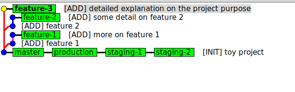
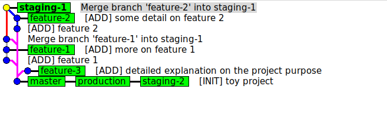
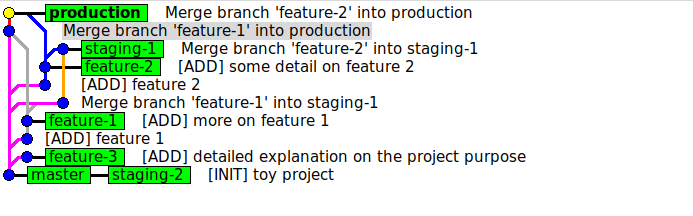

# Git Practice

## Note that this is a local Git practice. Working with remote branches should be similar - just keep in mind to always fetch & rebase the latest code from the corresponding remote branches before pushing.

1. Set up the usual Odoo customization repo branches
    * Production Branches:
        - production
    * Staging Branches:
        - staging-1
        - staging-2
    * Development Branches:
        - feature-1
        - feature-2
        - feature-3

```bash
mkdir toy-odoo
cd toy-odoo/
git init
echo 'hello world, this is a toy project.' > init.txt
git add . && git commit -m '[INIT] toy project'
git branch production
git checkout production
git branch staging-1
git branch staging-2
git branch feature-1
git branch feature-2
git branch feature-3
```

2. Dev
* Developing feature 1
```sh
git checkout feature-1
echo 'feature 1' > feature_1.txt
git add . && git commit -m '[ADD] feature 1'
echo 'more on feature 1' >> feature_1.txt
git add . && git commit -m '[ADD] more on feature 1'
```
* Developing feature 2
```sh
git checkout feature-2
echo 'feature 2' > feature_2.txt
git add . && git commit -m '[ADD] feature 2'
echo 'adding some details to feature 2' >> feature_2.txt
git add . && git commit -m '[ADD] some detail on feature 2'
```
* Developing feature 3
```sh
git checkout feature-3
echo 'more explanation' >> init.txt  # modify the content of init.txt
git add . && git commit -m '[ADD] detailed explanation on the project purpose'
```

* What the repo looks like now
```sh
# use git log or gitk to see what actually happened, I'll use gitk 
git log --all --graph --decorate --oneline --simplify-by-decoration
gitk --all
```


3. After testing with demo data, we think our feature 1 and feature 2 can be tested with staging data
```sh
git checkout staging-1
git merge --no-ff feature-1  # use --no-ff (no fast forward) to make the log/graph look more sensible, better for record keeping
git merge --no-ff feature-2
gitk --all
```


4. We tested feature 1 and feature 2, we are sure that we want them in production
    * There are different ways to merge multiple features into production, but merging them one-by-one is considered the best practice. This will also make it easier for us to revert a single feature from production in the future.

```sh
git checkout production
git merge --no-ff feature-1
git merge --no-ff feature-2
git diff staging-1
git diff staging-2
gitk --all
```


5. Notice our staging-2 is now different from production, which is not desired. So let's keep it the same with the current production
```sh
git checkout staging-2
git rebase production  # avoid using rebase/reset on branches that are not personal. Rebases rewrite history and are impossible to trace after the fact. They will also cause issues if somebody has based work of of this branch.
gitk --all
```

